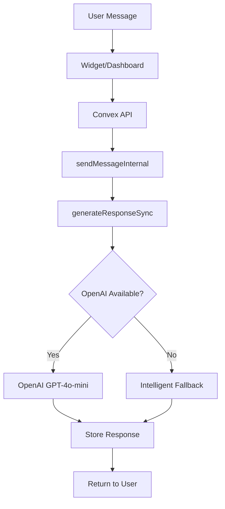

# 🤖 OpenAI Integration Guide - ChatIt.cloud

## Overview

ChatIt.cloud now features **full OpenAI GPT-4 integration** for intelligent, contextual AI responses. This guide covers setup, configuration, and usage of the OpenAI-powered chatbot system.

## 🚀 Quick Start

### 1. Environment Setup

To enable OpenAI responses, add your API key to the environment:

```bash
# In your Convex environment or .env.local
OPENAI_API_KEY=sk-your-actual-openai-api-key-here
```

**Without an API key:** The system automatically falls back to intelligent rule-based responses.

### 2. Start the System

```bash
# Start Convex backend
npx convex dev

# Start frontend (in another terminal)
npm run dev
```

### 3. Test the Integration

Visit the test page: `http://localhost:5173/test-openai-connection.html`

## 🔧 System Architecture

### AI Response Flow



### Key Components

1. **`convex/ai.ts`** - OpenAI integration service
2. **`convex/conversations.ts`** - Message handling and response generation
3. **Widget System** - Real-time chat interface
4. **Fallback System** - Intelligent responses when OpenAI unavailable

## 📋 API Reference

### Core AI Functions

#### `generateResponseSync` (Internal Action)
```typescript
// Real-time OpenAI response generation
await ctx.runAction(internal.ai.generateResponseSync, {
  conversationId: "conv_123",
  userMessage: "Hello!",
  chatbotId: "bot_456"
});
```

#### `loadContext` (Internal Query)
```typescript
// Load conversation context for AI
const context = await ctx.runQuery(internal.ai.loadContext, {
  conversationId: "conv_123",
  chatbotId: "bot_456"
});
```

#### `getFallbackResponse` (Internal Query)
```typescript
// Get intelligent fallback when OpenAI unavailable
const response = await ctx.runQuery(internal.ai.getFallbackResponse, {
  userMessage: "Hello!",
  chatbotId: "bot_456"
});
```

### OpenAI Configuration

```typescript
const openai = new OpenAI({
  apiKey: process.env.OPENAI_API_KEY || "sk-placeholder"
});

const response = await openai.chat.completions.create({
  model: "gpt-4o-mini", // Cost-efficient model
  messages: context.messages,
  max_tokens: 500,
  temperature: 0.7,
  top_p: 1,
  frequency_penalty: 0,
  presence_penalty: 0,
});
```

## 🎯 Chatbot Configuration

### System Prompt Structure

Each chatbot gets a personalized system prompt:

```typescript
const systemPrompt = `You are ${chatbot.name}, ${chatbot.description}.

Instructions: ${chatbot.instructions}

Respond naturally and conversationally. Keep responses concise but informative. 
If you don't know something specific, offer to help in other ways or suggest contacting support.`;
```

### Example Chatbot Setup

```typescript
const demoChatbot = {
  name: "Demo Support Bot",
  description: "A helpful customer support chatbot powered by OpenAI GPT-4",
  instructions: `You are a friendly customer support assistant for ChatIt.cloud.
  
  Help users with:
  - Platform features and capabilities
  - Integration and setup questions  
  - Pricing and subscription information
  - Technical support
  - Widget customization
  
  About ChatIt.cloud:
  - AI-powered chatbots with OpenAI GPT-4 integration
  - Customizable widgets with CORS support
  - Real-time analytics and sentiment analysis
  - Easy integration with HTML embed code`
};
```

## 🔄 Fallback System

When OpenAI is unavailable, the system uses intelligent fallback responses:

### Greeting Detection
```typescript
if (lowerMessage.includes("hello") || lowerMessage.includes("hi")) {
  return `Hello! I'm ${botName}. How can I help you today?`;
}
```

### Help Requests
```typescript
if (lowerMessage.includes("help") || lowerMessage.includes("support")) {
  return `I'm here to help! As ${botName}, I can assist you with questions and provide information.`;
}
```

### Pricing Inquiries
```typescript
if (lowerMessage.includes("price") || lowerMessage.includes("cost")) {
  return "For detailed pricing information, please contact our sales team or visit our pricing page.";
}
```

## 🧪 Testing & Debugging

### Test Pages

1. **OpenAI Connection Test**: `/test-openai-connection.html`
   - Backend status verification
   - OpenAI configuration check
   - Live AI response testing
   - Interactive chat demo

2. **Complete System Test**: `/widget-complete-test.html`
   - End-to-end system testing
   - Widget embedding verification
   - Production deployment checks

### Debug Checklist

✅ **Backend Running**: `npx convex dev` active  
✅ **API Key Set**: `OPENAI_API_KEY` in environment  
✅ **Chatbot Created**: Demo or custom chatbot exists  
✅ **Widget Embedded**: Correct chatbot ID in widget code  
✅ **CORS Enabled**: Headers configured for cross-origin requests  

### Common Issues

| Issue | Solution |
|-------|----------|
| "Let me think about that..." responses | Check OpenAI API key configuration |
| Network errors | Ensure Convex backend is running |
| CORS errors | Verify vite.config.ts CORS settings |
| Fallback responses only | Check OpenAI API key and quota |

## 📊 Response Quality

### OpenAI Responses
- **Contextual**: Understands conversation history
- **Intelligent**: Handles complex queries and follow-ups
- **Personalized**: Uses chatbot name and instructions
- **Natural**: Conversational tone and appropriate responses

### Fallback Responses  
- **Pattern-based**: Recognizes common intents
- **Branded**: Uses chatbot name and context
- **Helpful**: Provides useful information even without AI
- **Graceful**: Smooth degradation when OpenAI unavailable

## 🚀 Production Deployment

### Environment Variables

```bash
# Production environment
OPENAI_API_KEY=sk-your-production-api-key
CONVEX_DEPLOYMENT=your-production-deployment
```

### Performance Optimization

1. **Model Selection**: Using `gpt-4o-mini` for cost efficiency
2. **Token Limits**: 500 max tokens for concise responses  
3. **Context Management**: Last 10 messages for relevant context
4. **Caching**: Convex handles response caching automatically

### Monitoring

- **Response Times**: Monitor via Convex dashboard
- **API Usage**: Track OpenAI API consumption
- **Error Rates**: Monitor fallback usage vs OpenAI success
- **User Satisfaction**: Sentiment analysis in conversations

## 🔐 Security & Best Practices

### API Key Security
- ✅ Store in environment variables only
- ✅ Never expose in client-side code
- ✅ Use different keys for development/production
- ✅ Monitor API usage and set limits

### Content Safety
- ✅ OpenAI's built-in content filtering
- ✅ Custom instruction guidelines
- ✅ Conversation logging for review
- ✅ User feedback collection

### Rate Limiting
- ✅ OpenAI API rate limits respected
- ✅ Graceful fallback when limits exceeded
- ✅ User-friendly error messages
- ✅ Automatic retry logic

## 📈 Analytics & Insights

### Conversation Metrics
- **AI vs Fallback Ratio**: Track OpenAI usage success
- **Response Quality**: User satisfaction scores
- **Common Topics**: Analyze conversation patterns
- **Performance**: Response time and error rates

### Sentiment Analysis
- **Automatic Detection**: Positive/negative/neutral classification
- **Conversation Trends**: Track sentiment over time
- **Issue Identification**: Flag negative sentiment for review
- **Success Metrics**: Measure conversation outcomes

## 🎉 Success Indicators

Your OpenAI integration is working correctly when you see:

✅ **Contextual Responses**: AI remembers conversation history  
✅ **Natural Language**: Responses feel human-like and relevant  
✅ **Brand Consistency**: AI follows chatbot instructions and personality  
✅ **Error Handling**: Graceful fallbacks when needed  
✅ **Performance**: Fast response times (< 3 seconds)  

## 🆘 Support

### Documentation
- **This Guide**: Complete OpenAI integration reference
- **API Docs**: Convex function documentation
- **Widget Guide**: Embedding and customization
- **System Guide**: Overall platform architecture

### Testing Tools
- **Test Pages**: Built-in verification tools
- **Console Logs**: Browser developer tools
- **Convex Dashboard**: Backend monitoring
- **OpenAI Dashboard**: API usage tracking

---

**🎊 Congratulations!** You now have a fully functional AI chatbot system powered by OpenAI GPT-4, with intelligent fallbacks and comprehensive testing tools! 